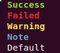

[](https://travis-ci.org/wenchma/goutils)

# Utils for Golang


## Usage for table

[table usage](./table.md)

## Usage for Colorize

```bash
fmt.Println(Colorize("Success", "success"))
fmt.Println(Colorize("Failed", "fail"))
fmt.Println(Colorize("Warning", "warn"))
fmt.Println(Colorize("Note", "note"))
fmt.Println(Colorize("Default", ""))
```

**Output example**:




## Usage for checksum

[checksum usage](./checksum/README.md)
